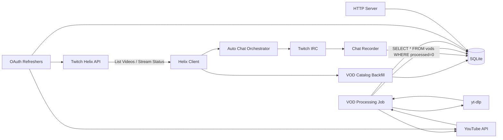
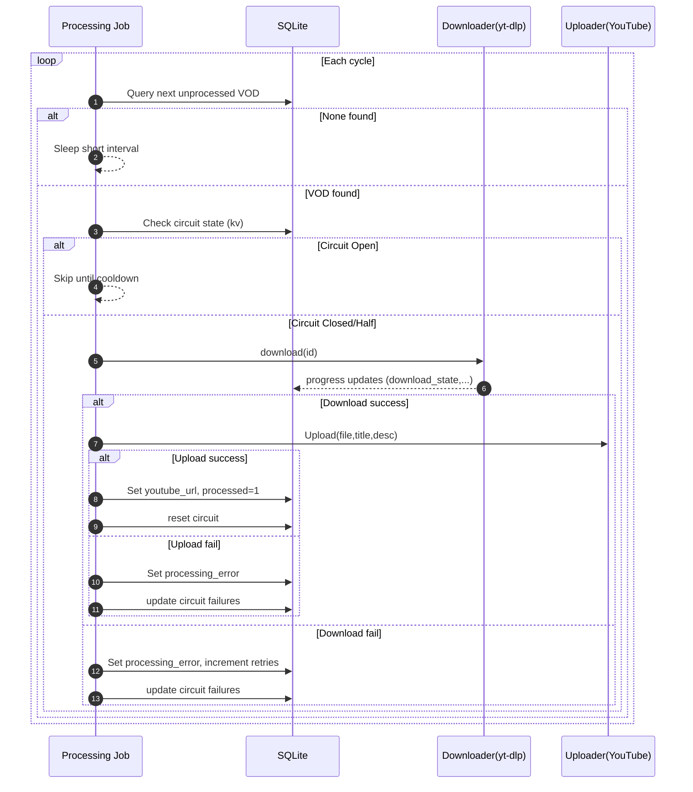
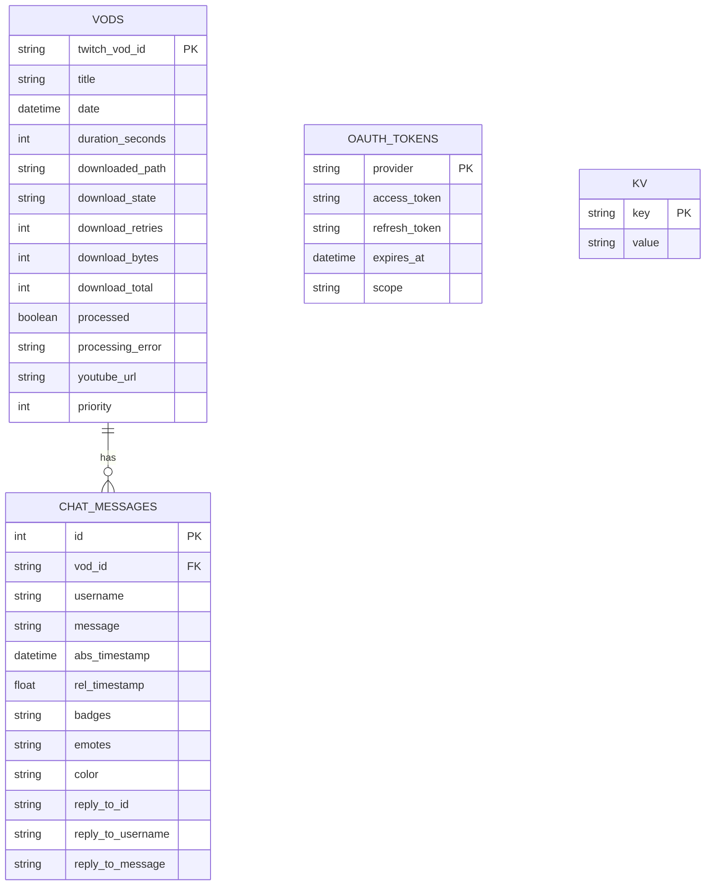

## Architecture Overview

vod-tender ingests Twitch VOD metadata and live chat, downloads VOD video files, and (optionally) uploads processed videos to YouTube. It is a small Go service optimized for a single Twitch channel (multi-channel extension is straightforward) with a lightweight SQLite persistence layer and job-style background workers.

### High-Level Components

| Component               | Package              | Responsibility                                                                                              |
| ----------------------- | -------------------- | ----------------------------------------------------------------------------------------------------------- |
| Configuration           | `config`             | Environment variable parsing & defaults                                                                     |
| Database                | `db`                 | SQLite connection & schema migrations, token storage                                                        |
| Twitch Chat Recorder    | `chat`               | Connect to Twitch IRC, persist chat messages with relative & absolute timestamps                            |
| Auto Chat Orchestrator  | `chat/auto.go`       | Poll Helix live status, start/stop chat recorder, reconcile placeholder VOD id with real VOD once published |
| VOD Model & Helpers     | `vod/vod.go`         | Core VOD struct, simple latest VOD discovery, download implementation, circuit breaker helpers              |
| VOD Catalog Backfill    | `vod/catalog.go`     | Historical/paged Helix listing, periodic catalog insertion, metadata backfill, Twitch duration parsing      |
| VOD Processing Pipeline | `vod/processing.go`  | Picks unprocessed VODs, drives download + YouTube upload (via injected interfaces)                          |
| Twitch Helix Client     | `twitchapi/helix.go` | Thin wrapper for user id and paged video listing using app access token caching                             |
| OAuth Token Refresh     | `oauth`              | Periodic refresh for Twitch & YouTube tokens with jitter windows                                            |
| YouTube API             | `youtubeapi`         | OAuth client creation + UploadVideo helper                                                                  |
| HTTP Server             | `server`             | Minimal health / API endpoints (OpenAPI spec in `api/openapi.yaml`)                                         |

### Process & Data Flow (Happy Path)

1. Service starts (`main.go`): loads config, migrates DB, launches background jobs (chat, processing, catalog backfill, token refreshers, HTTP server).
2. Catalog backfill job populates historical VOD rows (idempotent) for the configured channel using Helix paginated API.
3. Processing job periodically selects the earliest unprocessed VOD (ordered by processed flag, priority, date) and:
   - Downloads video via `yt-dlp` (with resume & exponential backoff; progress persisted).
   - Uploads the completed file to YouTube (if YouTube credentials/token exist) and stores returned URL.
   - Marks VOD as processed or sets `processing_error` upon failure.
4. Auto chat recorder (optional) polls live status:
   - On stream start: inserts placeholder VOD row `live-<unix>` and records chat messages referencing that ID.
   - On stream end: repeatedly polls VOD list until actual VOD appears, then reconciles: renames chat rows to real VOD id and time-shifts relative timestamps if needed.
5. OAuth refreshers proactively renew tokens and update the `oauth_tokens` table.

### Concurrency Model

All long-running activities are goroutines governed by a root `context.Context` cancelled by OS signals (SIGINT/SIGTERM). Jobs use internal tickers:

- Processing job: loop with short sleep when idle (see `StartVODProcessingJob`).
- Catalog backfill: ticker (default 6h) + initial immediate run.
- Auto chat: configurable poll interval (default 30s).
- Token refreshers: jittered timers within min/max intervals to avoid thundering herd if multiple instances ever run.

### Database Schema (Key Tables)

`vods` tracks metadata and processing state:

- `twitch_vod_id`: stable identifier (placeholder in auto mode until reconciled).
- `download_state`, `download_bytes/total`, `progress_updated_at`: incremental progress & telemetry.
- `processed`, `processing_error`, `youtube_url`, `priority`.

`chat_messages` stores captured chat bound to `vod_id` with both absolute and relative (to stream start) timestamps plus optional reply metadata.

`oauth_tokens` manages access + refresh tokens with expiry for each provider (`twitch`, `youtube`).

`kv` is a generic key/value store for:

- Catalog pagination cursor (`catalog_after`).
- Circuit breaker state (`circuit_state`, `circuit_failures`, `circuit_open_until`).

### VOD Processing Pipeline

Core function: `processOnce` (in `processing.go`). Pseudocode:

```
select next unprocessed VOD ordered by processed=0, priority DESC, date ASC
if circuit open -> skip until cooldown passes
download via downloader.Download(ctx, db, vodID, dataDir)
  - wrapper around internal `downloadVOD` using yt-dlp (resume, retries)
upload via uploader.Upload(...) -> YouTube (optional; can be stub)
update DB with youtube_url + processed=1, reset circuit on success
on error: store processing_error, increment failures, maybe open circuit
```

Abstractions:

- `Downloader` interface (default `ytDLPDownloader`): enables deterministic test mocks.
- `Uploader` interface (default YouTube uploader; can be no-op) for optional publishing.

### Download Subsystem

`downloadVOD` uses `yt-dlp` with:

- Resume (`--continue`) & infinite internal retries.
- Exponential backoff at wrapper level for process invocation (configurable attempts + base).
- Progress parsing via stderr regex; approximate bytes stored in DB.
- External downloader (aria2c) auto-enabled if present for improved robustness.
- Cancellation: a cancel func registered per VOD ID for external termination.

### Chat Recording & Reconciliation

- Chat messages recorded with relative timestamp = (message_time - placeholder_start_time) seconds.
- Reconciliation window attempts to map placeholder to final VOD by enumerating recent VODs and selecting the one whose start time is within a ±10m window around recorded start (favoring the latest non-future candidate).
- Timestamp correction: If actual VOD start differs, relative timestamps are shifted (SQL arithmetic) before relinking chat rows to new VOD ID.

### Catalog Backfill

- Uses Helix paginated listing with cursor persisted in `kv` to enable incremental historical ingestion when `maxAge==0`.
- Rate moderation: 1.2s delay between pages to respect Twitch Helix rate limits.
- Dedup: insertion uses `INSERT OR IGNORE` on `vods`.
- `parseTwitchDuration` converts Twitch duration strings like `3h2m15s` into seconds.

### OAuth & Token Refresh

- Twitch app token fetched on startup (best effort) & lazily by Helix client via `TokenSource` (caches until expiry < 2m).
- Refreshers: generic jittered scheduler calling provider-specific refresh logic and updating `oauth_tokens` row.
- YouTube: uses OAuth2 config + refresh token to acquire fresh access token; optional if uploading disabled.

### Circuit Breaker

- Enabled when `CIRCUIT_FAILURE_THRESHOLD` > 0.
- Each processing failure increments `circuit_failures`; reaching threshold sets `circuit_state=open` and `circuit_open_until` (cooldown, default 5m or `CIRCUIT_OPEN_COOLDOWN`).
- Success path resets breaker to closed and clears failures.
- Prevents hot-looping on systemic failures (e.g. API outage, credentials invalid, persistent disk errors).

### Configuration Surface (Highlights)

Refer to `docs/CONFIG.md` for exhaustive list. Key toggles:

- `CHAT_AUTO_START=1` activates auto live poller; else manual single-VOD chat session.
- `VOD_CATALOG_BACKFILL_INTERVAL`, `VOD_CATALOG_MAX`, `VOD_CATALOG_MAX_AGE_DAYS` tailor catalog ingestion.
- Download tuning: `DOWNLOAD_MAX_ATTEMPTS`, `DOWNLOAD_BACKOFF_BASE`.
- Circuit breaker: `CIRCUIT_FAILURE_THRESHOLD`, `CIRCUIT_OPEN_COOLDOWN`.

### Extensibility Points

- Swap downloader (e.g., custom transcoder chain) by assigning to `vod.downloader` global before job start.
- Swap uploader (e.g., S3 archival) by implementing `Uploader` and assigning to `vod.uploader`.
- Replace Helix client to mock Twitch API or to support multi-channel (wrap discovery call with channel parameterization).
- Add metrics by instrumenting key points (download progress loop, processOnce result) with your metrics library of choice (no hard dependency at present).

### Testing Strategy

`processing_test.go` exercises:

- Duration parsing corner cases.
- Happy path processing (mocked download & upload).
- Download failure path sets `processing_error` correctly.

Recommended future tests:

- Circuit breaker open/close transitions.
- Auto chat reconciliation (can be unit-tested with in-memory DB & fake Helix responses).
- Helix pagination edge cases (empty pages, rate limiting / error responses).

### Future Enhancements (Roadmap Ideas)

- Request/job correlation IDs (extend structured JSON logging).
- Prometheus metrics (download throughput, queue depth, breaker state).
- Pluggable storage backends (Postgres, object storage for large media).
- Partial video clipping & highlight extraction before upload.
- Multi-channel scaling: partition tables by channel or add channel columns / indices.
- Encryption at rest for OAuth tokens (current plain storage acceptable for local dev but not production-grade).
- Web UI for administration (priority adjustments, manual retry, cancel download, breaker status needle).

---

For configuration details see `CONFIG.md`. For operational guidance see `OPERATIONS.md`.

### Observability Additions

Current implementation includes:

- Structured logging via `slog` with selectable format (`LOG_FORMAT=text|json`) and level (`LOG_LEVEL`). Components emit logs with `component` field (e.g., `vod_process`, `vod_download`). Timing fields (`download_ms`, `upload_ms`, `total_ms`) and queue depth snapshots allow quick ad‑hoc analysis.
- Exponential moving averages (EMA) maintained in the `kv` store for download, upload, and total processing durations (`avg_download_ms`, `avg_upload_ms`, `avg_total_ms`). The smoothing factor favors recent runs while retaining historical trend (simple alpha decay; see implementation in `vod/processing.go`).
- `/status` endpoint returns concise JSON: queue counts (pending, errored, processed), circuit breaker fields, moving averages, and last processing timestamp (`job_vod_process_last`). Intended for lightweight dashboards or CLI `curl` checks.
- `/metrics` endpoint exposes Prometheus metrics (downloads/uploads counts, durations, queue depth, circuit open gauge).
- `/admin/monitor` provides a broader set of job timestamps; may be deprecated once metrics exporter exists.

Correlation IDs:

- HTTP middleware assigns / reuses `X-Correlation-ID` (uuid) – injected into request context & surfaced in logs (`corr` field) across downstream processing & download logs for end-to-end traceability.

Example `/status` response:

```json
{
  "pending": 2,
  "errored": 1,
  "processed": 57,
  "circuit_state": "closed",
  "avg_download_ms": "4200",
  "avg_upload_ms": "1800",
  "avg_total_ms": "6700",
  "last_process_run": "2025-08-12T11:23:45Z"
}
```

Planned next step: surface these values via metrics (Prometheus) and introduce correlation IDs for tracing a VOD through discovery → download → upload.

### Diagrams (Mermaid)

#### Component Interaction



#### VOD Processing Sequence



#### Auto Chat Reconciliation Sequence

```mermaid
sequenceDiagram
   participant Auto as Auto Poller
   participant Helix as Helix API
   participant Chat as Chat Recorder
   participant DB as SQLite
   Auto->>Helix: streams? (user_login)
   Helix-->>Auto: live? started_at
   Auto->>DB: Insert placeholder VOD (live-<unix>)
   Auto->>Chat: Start with placeholder id
   Chat-->>DB: Insert chat_messages(rel_timestamp)
   Auto->>Helix: (polling) stream offline detected
   Auto-->>Chat: cancel context
   Auto-->>Auto: Wait reconcile delay
   loop Until window expires
      Auto->>Helix: list videos
      Helix-->>Auto: recent VODs
      alt Matching VOD found
         Auto->>DB: Insert/Update real VOD row
         Auto->>DB: Shift rel_timestamp if needed
         Auto->>DB: UPDATE chat_messages SET vod_id=real
         Auto->>DB: DELETE placeholder VOD
         Auto-->>Auto: Reconciliation complete
         break
      else Not found
         Auto-->>Auto: Sleep 30s
      end
   end
```

#### Data Model (ER)



### Reliability & Error Handling

| Concern                      | Current Mechanism                                     | Future Enhancements                                                            |
| ---------------------------- | ----------------------------------------------------- | ------------------------------------------------------------------------------ |
| Transient download failures  | yt-dlp internal retries + wrapper exponential backoff | Distinguish fatal vs transient error classes; jittered multi-host coordination |
| Systemic processing failures | Circuit breaker (kv)                                  | Half-open probing; metrics-driven open/close decisions                         |
| Chat recorder disconnects    | Twitch IRC reconnect logic (implicit)                 | Explicit backoff & alerting                                                    |
| Helix rate limits            | Modest page delay (1.2s)                              | Adaptive pacing based on headers                                               |
| Token expiry                 | Proactive refresh (jitter)                            | Central token cache TTL metrics                                                |
| Crash recovery               | Idempotent inserts; resumable downloads               | Checkpoint upload progress (resumable YouTube upload)                          |

### Observability Plan

Current: logs only.
Recommended additions:

- Metrics: counters (downloads_started, downloads_failed), gauges (queue_depth, breaker_state), histograms (download_duration_seconds).
- Tracing: wrap external calls (Helix, YouTube) with spans; correlate VOD id.
- Structured logging: include fields `component`, `vod_id`, `attempt`, `circuit_state`.
- Health endpoint: add JSON summarizing pending VOD count, breaker state, last catalog sync time.

### Performance & Capacity Notes

| Dimension           | Current Baseline             | Notes                                                                         |
| ------------------- | ---------------------------- | ----------------------------------------------------------------------------- |
| Download throughput | Single active process        | Bandwidth bound; parallelization requires throttling & disk IO considerations |
| DB contention       | Low (sequential jobs)        | WAL mode can improve concurrent read performance                              |
| Memory footprint    | Minimal (no large buffering) | Ensure yt-dlp not forced into in-memory operations                            |
| CPU hotspots        | Video download (I/O)         | Upload CPU negligible unless future transcoding added                         |

### Multi-Channel Scaling Blueprint

Steps:

1. Add `channel` column to `vods`, `chat_messages` (index by (channel, date), (channel, processed)).
2. Parameterize channel in Helix calls; spawn per-channel catalog + processing goroutines controlled by supervisor.
3. Introduce rate limiter keyed by channel + provider endpoint.
4. Abstract token storage to include channel-scoped tokens if needed.
5. Add channel dimension to metrics & API.

### Extension Patterns (Examples)

Swap downloader (e.g., to perform on-the-fly transcoding):

```go
type ffmpegDownloader struct{}
func (f ffmpegDownloader) Download(ctx context.Context, db *sql.DB, id, dir string) (string, error) { /* custom impl */ return "", nil }
vod.downloader = ffmpegDownloader{}
```

Custom uploader (e.g., S3 archive):

```go
type s3Uploader struct{ bucket string }
func (u s3Uploader) Upload(ctx context.Context, path, title string, date time.Time) (string, error) { /* put to S3 */ return s3URL, nil }
vod.uploader = s3Uploader{bucket: "vod-archive"}
```

### Edge Cases & Handling

| Case                            | Current Behavior               | Potential Improvement                                |
| ------------------------------- | ------------------------------ | ---------------------------------------------------- |
| Placeholder never reconciles    | Expires after window silently  | Emit warning metric / alert after expiry             |
| Very long streams (>48h)        | Duration parse still fine      | Validate against Helix retention / partial downloads |
| Partial download then crash     | Resumed by yt-dlp `--continue` | Verify checksum / integrity before upload            |
| Upload fails with transient 5xx | Marks processing_error         | Add retry with backoff distinct from download loop   |
| Token refresh race              | Last write wins                | Employ singleflight to reduce duplicate refreshes    |

### Design Rationale (Selected Decisions)

| Decision                       | Rationale                                       | Trade-offs                                      |
| ------------------------------ | ----------------------------------------------- | ----------------------------------------------- |
| SQLite                         | Zero external dependency, simple dev deploy     | Limited concurrency & scaling without migration |
| External tool (yt-dlp)         | Mature feature set (resuming, format selection) | Shelling out; parse fragile stderr format       |
| Interfaces for download/upload | Testability & future pluggability               | Slight indirection overhead                     |
| KV table for breaker/cursor    | Lightweight flexible metadata                   | No schema constraints; risk of key typos        |

### Security Considerations

Current simple model adequate for dev / low-risk personal use. For production:

- Encrypt `oauth_tokens` (application-level or SQLite extension).
- Limit process permissions (no root, least privilege file access).
- Rotate refresh tokens periodically; monitor token scope changes.
- Implement authN/Z for any future admin endpoints.

### Testing Roadmap (Beyond Existing)

| Area               | Test Idea                                                                     |
| ------------------ | ----------------------------------------------------------------------------- |
| Circuit breaker    | Simulate N failures then a success to ensure close transition                 |
| Reconciliation     | Fake Helix responses shifting start time to test timestamp delta math         |
| Pagination         | Mock multi-page Helix with early cutoff via maxAge & maxCount                 |
| Download cancel    | Trigger `CancelDownload` mid-progress and assert DB state not marked complete |
| Upload retry logic | (After implemented) transient failures succeed after delay                    |

### Observability Snippet (Example Metrics Instrumentation)

```go
// Pseudocode
metrics.Counter("downloads_started").Inc()
start := time.Now()
path, err := downloader.Download(ctx, db, id, dir)
metrics.Histogram("download_duration_seconds").Observe(time.Since(start).Seconds())
if err != nil { metrics.Counter("downloads_failed").Inc() }
```

### Admin / Health Endpoint (Future Sketch)

JSON structure idea:

```json
{
  "pending_vods": 3,
  "circuit": { "state": "closed", "failures": 0, "open_until": null },
  "last_catalog_sync": "2025-08-12T10:15:00Z",
  "uptime_seconds": 864
}
```

---

This extended section augments the core architecture with implementation rationale, scaling and observability guidance, and concrete extension examples.
